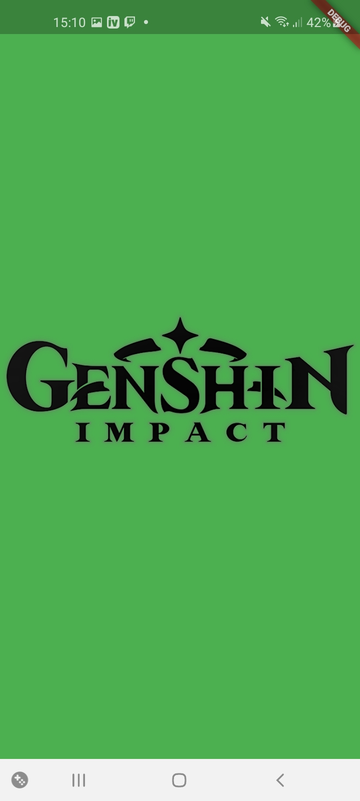
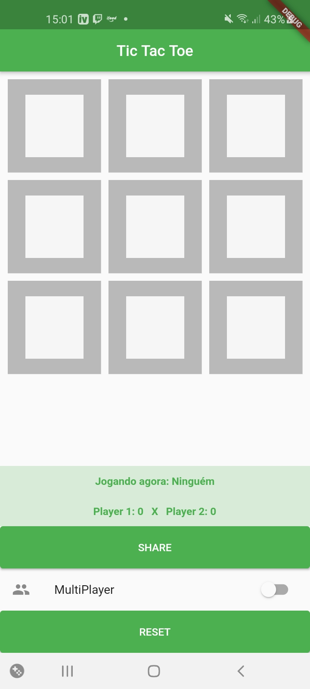
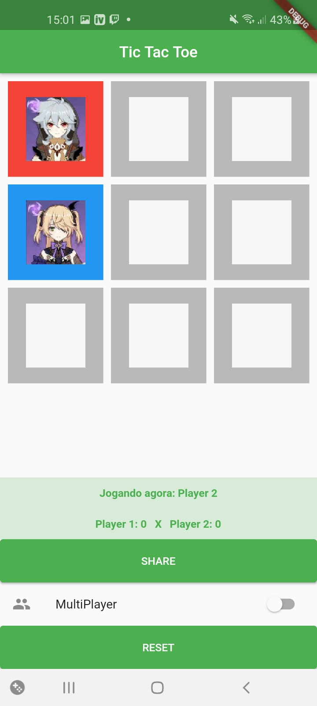
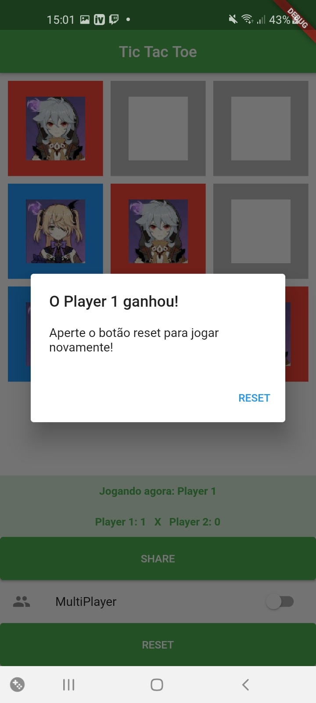
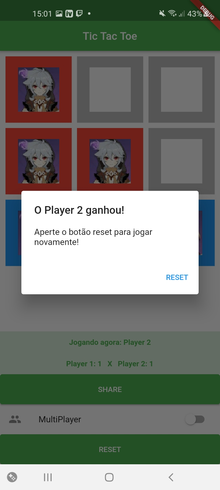
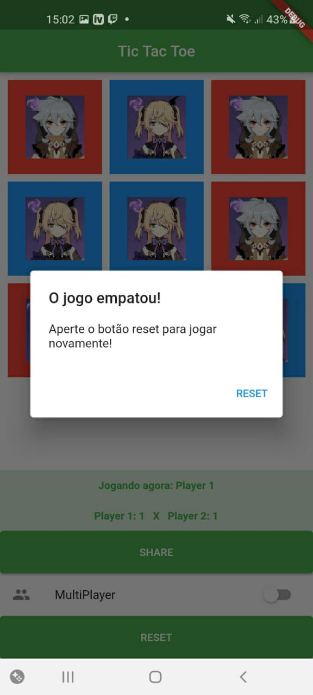

# Tic Tac Toe

Jogo da velha (Tic Tac Toe) criado para disciplina de Programação Mobile, criado por Kleber de Oliveira Andrade. Desafios resolvidos por Lucas Pereira Melo.    

Tutorial de criação deste app: [clique aqui](https://medium.com/@kleberandrade/criando-um-jogo-da-velha-em-flutter-50347537c926)

    
    
    
    
    
    

## Desafio para aula

*   [x] Exibir o jogador da vez (Turno do X ou Turno do Y); Pode usar um Text para isso.
*   [x] Criar um placar de vitórias para cada jogador; Pode usar Text também
*   [x] Criar uma splash screen para o aplicativo; Utilize o [plugin custom_splash](https://pub.dev/packages/custom_splash).
*   [x] Adicionar um botão para compartilhar o aplicativo. Utilize o [plugin Share](https://pub.dev/packages/share).
*   [x] Trocar o X e Y por duas imagens (exemplo: Finn e Jake de Adventure Time) — como [utilizar imagens](https://flutter.dev/docs/development/ui/assets-and-images). Entendendo como colocar [imagens em um Container](https://medium.com/flutteropen/flutter-widgets-03-image-558e2b24059e).

## Licença

    Copyright 2020 Kleber de Oliveira Andrade
    
    Permission is hereby granted, free of charge, to any person obtaining a copy
    of this software and associated documentation files (the "Software"), to deal
    in the Software without restriction, including without limitation the rights
    to use, copy, modify, merge, publish, distribute, sublicense, and/or sell
    copies of the Software, and to permit persons to whom the Software is
    furnished to do so, subject to the following conditions:
    
    The above copyright notice and this permission notice shall be included in all
    copies or substantial portions of the Software.
    
    THE SOFTWARE IS PROVIDED "AS IS", WITHOUT WARRANTY OF ANY KIND, EXPRESS OR
    IMPLIED, INCLUDING BUT NOT LIMITED TO THE WARRANTIES OF MERCHANTABILITY,
    FITNESS FOR A PARTICULAR PURPOSE AND NONINFRINGEMENT. IN NO EVENT SHALL THE
    AUTHORS OR COPYRIGHT HOLDERS BE LIABLE FOR ANY CLAIM, DAMAGES OR OTHER
    LIABILITY, WHETHER IN AN ACTION OF CONTRACT, TORT OR OTHERWISE, ARISING FROM,
    OUT OF OR IN CONNECTION WITH THE SOFTWARE OR THE USE OR OTHER DEALINGS IN THE
    SOFTWARE.
